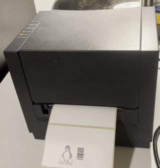

# Argox PPLA label printer over USB

This is a simple python program, that implements (most of) the PPLA protocol used by some late-90s label printers.

I implemented this, since I bought a cheap, old Argox R-400 plus printer, which (in my case) was loaded with the
PPLA firmware. While there is documentation about PPLA on the internet, I couldn'f find any python implementation.

## Usage

The `main.py` script prints a simple label. It does this by

- Opening USB device using pyUSB (libusb)
- Create PPLA commands using the PPLA class
- Send the commands to the printer

The `PPLA` class implements the PPLA protocol. It has methods for almost all commands that are documented.
The protocol is pretty terrible, so not all commands can be used in all combinations. Consult the docs to see how.

